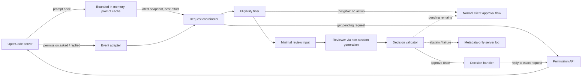
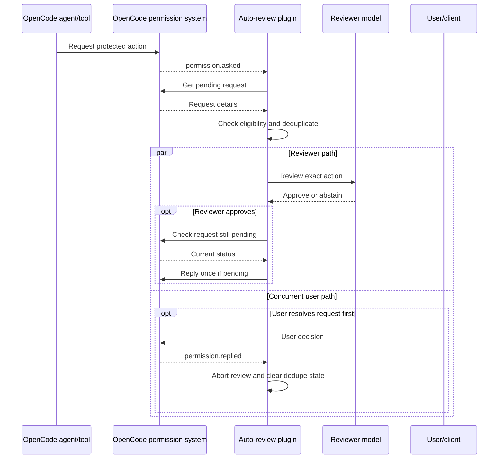

# OpenCode Auto-Approve Plugin: Architecture

> Historical design notes from the first implementation. Some status and UI
> descriptions below predate the TUI notification plugin, tool-source binding,
> and opt-in diagnostics. Use [README.md](README.md) and the source code for
> current installation and behavior.

## Status and scope

This document describes the implemented first slice of an OpenCode V2 auto-review plugin, inspired by Codex Auto-review. The implementation targets OpenCode and `@opencode/plugin` 2.0.20.

The repository is a TypeScript plugin package. The local OpenCode config loads it disabled by default.

### Goal

When OpenCode pauses on an action that requires approval, the plugin may submit that specific pending request for review and resolve it according to the reviewer's decision. The default behavior must preserve OpenCode's existing permission rules and hard-deny policies. Reviewer failure must not grant access.

### Non-goals for the first version

- Replacing or weakening OpenCode's permission model or sandbox boundaries.
- Automatically approving all shell commands, file accesses, or external-directory requests.
- Persisting broad `always` approvals on behalf of the user.
- Reviewing or rewriting every model/tool call before execution.
- Providing a TUI or client notification. The server plugin currently writes redacted status to the server console; the normal permission request remains available to the client.

## OpenCode V2 architecture findings

OpenCode plugins execute in the server-side plugin runtime. A plugin is defined with `Plugin.define({ id, setup(ctx) { ... } })`; local plugins can live under `.opencode/plugins/`, and configured package or directory plugins can be loaded through `plugins` in `opencode.json(c)`.

The V2 plugin context exposes:

- `ctx.permission.list({ sessionID })` and `ctx.permission.get({ sessionID, requestID })` for pending request inspection.
- `ctx.permission.reply({ sessionID, requestID, reply })` for a request decision. The documented reply values include `once`, `always`, and `reject`.
- `ctx.permission.rules({ sessionID, permissions })` for replacing session-scoped permission rules. These rules are evaluated after the agent's rules; child sessions inherit rules active when created.
- `ctx.event.subscribe({ signal })` for the connected server's public event stream.
- `ctx.generate.text(...)` for a model generation that does not create a session, invoke tools, or add to session history.
- `ctx.storage` for plugin-scoped durable JSON state.

V2 permission rules are ordered and the last matching rule wins. If no rule matches, OpenCode asks. OpenCode also has a distinct policy layer that can hard-deny a permission after ordinary rules and saved approvals. A policy denial cannot be overridden by an allow rule. Shell actions carry the host user's filesystem, process, and network authority; command/path inference is best-effort.

**Verified on 2026-10-01:** The installed OpenCode and pinned `@opencode/plugin` / `@opencode/client` versions are 2.0.20. A `permission.asked` event identifies the pending permission and optional assistant/tool-call source, but does not identify the initiating user-prompt message. The plugin captures direct prompt text through the V2 prompt hook and keeps it in a bounded in-memory cache. It does not retrieve session history, persist prompt text, or reconcile missed/replayed asks; those requests remain manual without a live ask event and prompt snapshot. Live compatibility checks confirmed event delivery, pending-request inspection, and a one-time reply for an isolated synthetic ask. No raw HTTP workaround is used.

## Codex behavior used as a design reference

Codex's Auto permission preset allows routine work inside its configured sandbox and asks for approval at boundaries such as workspace escape or network access. Codex Auto-review routes eligible actions that already require approval to a reviewer. The reviewer does not expand the sandbox, writable roots, or network access; it changes who evaluates an approval request.

This plugin adopts the **reviewer-swap** aspect, not an unrestricted auto-approve mode. It reviews only an existing pending request and, when approving, replies for that request once. It does not add a general allow rule. Any future convenience mode that automatically allows categories of routine actions requires a separate opt-in design and threat model.

## Design principles and decisions

1. **Review requests, not broad policy.** Use the pending-request/reply APIs. Do not call `ctx.permission.rules` in the initial feature. Changing session rules could supersede user/agent rules and create surprising behavior.
2. **Request-scoped approval.** Use the one-time `once` reply for an approved request. Never choose `always` implicitly or persist saved approval patterns.
3. **Fail closed to the normal flow.** Reviewer timeout, service/model error, invalid output, unknown request shape, or internal exception leaves the request pending for the client/user. Never translate uncertainty into approval.
4. **Respect hard denies.** Do not try to inspect or bypass policy denials. The plugin is not a mechanism for overriding OpenCode policies.
5. **Least disclosure.** Give the reviewer the exact permission action/resources and only the latest bounded direct prompt text as untrusted context. Do not include full conversation history, attachments, metadata, tool output, or file contents.
6. **Bound work.** Put limits on concurrent reviews, input size, and review duration. Deduplicate by session and request ID.
7. **Keep decisions auditable.** Record concise decision metadata (request ID, action category, outcome, reason, and timestamp) only if useful and safe. Do not persist raw prompts, secrets, command output, or file contents by default.
8. **Make reviewer outputs untrusted input.** Parse a strict structured result and reject malformed, ambiguous, or extra-content responses. Reviewer text cannot alter plugin policy or request identity.

## Implemented components

| Component | Responsibility |
| --- | --- |
| Plugin bootstrap | Validate options, register monitoring, own cancellation/cleanup, and report startup failures without enabling permissive behavior. |
| Event adapter | Consume `permission.asked` as a wake-up hint and `permission.replied` as a resolution notice; do not make policy decisions here. |
| Request coordinator | Handle live `permission.asked` events; bind the current same-session prompt-hook snapshot; deduplicate by `(sessionID, requestID)`; enforce queue/concurrency limits and timeouts. Missed/replayed asks without a live event-bound snapshot stay manual. |
| Eligibility filter | Apply the configured action allowlist and any explicit limits. Requests outside the allowlist remain pending for normal client approval. |
| Review-input builder | Construct the minimum bounded input for the reviewer; clearly mark the requested operation as untrusted data, not instructions. |
| Reviewer | Use `ctx.generate.text` to produce a constrained `approve`/`abstain` decision with a validated justification. The justification is not displayed in the client UI. |
| Decision validator | Validate schema, request identity, eligibility, justification, timeout, and that the request is still pending before taking action. |
| Decision handler | Reply `once` only for an approved request; on abstention or failure, leave it pending. |
| Status logging | Emit metadata-only server-console messages for abstention/failure/approval. No client notification API is available through this server-plugin context. |

### Status and user experience

A negative review is not a permission `reject`: it leaves the request pending so the user can decide. The current plugin reports status in the server console using request/session IDs, not full command/resource data or reviewer justification.

The V2 server-plugin guide does not document a toast/notification method on that context. The chosen first slice therefore has no client notification; the unresolved ask remains visible through OpenCode's ordinary approval flow. A paired CLI plugin or documented server-to-client bridge can be considered separately. See [V2 CLI plugin guide](https://opencode.ai/v2/docs/build/plugins/cli).

**UI scope:** The public V2 CLI-plugin guide documents TUI UI extension points (toasts, dialogs, routes/tabs, slots, and session panels). The server plugin's RPC API can expose methods/events for other plugins and clients, but its event subscriptions are live-only, so a paired TUI plugin should reconcile current review state when it starts or reconnects. The public docs reviewed here do not establish a plugin UI extension API for the web or desktop apps. Treat TUI UI as supported by the documented CLI plugin API; treat web/desktop custom UI as unsupported/unverified unless those apps separately document a compatible extension surface. Server-side review and permission handling should still work without a UI plugin.

### Component diagram



## Request flow

1. Register the prompt hook, capturing only direct prompt text, session ID, and prompt message ID in a bounded in-memory cache. Then subscribe to the event stream. Prompt text is not persisted or logged.
2. On a live `permission.asked`, snapshot the latest cached prompt for that session and bind it to that request's job. The event does not include the initiating user-prompt ID, so this is best-effort context, not proof of causation. Missing/invalid context leaves the request manual.
3. `permission.replied` cancels matching in-flight work. Before retry and immediately before replying, require the current prompt snapshot to match the job's message ID and text. Replayed/missed asks without a live event-bound snapshot are not reconciled.
4. The coordinator deduplicates by session/request ID and enforces queue/concurrency bounds. The eligibility filter applies the exact configured action allowlist.
5. The review-input builder creates a bounded prompt. Action/resources and user text are separately JSON-encoded and marked untrusted; user text is context, not authorization to widen the permission.
6. The reviewer returns a strict `approve` or `abstain` decision and concise justification. Malformed response or timeout is not approval.
7. Before replying, the plugin confirms the exact request is still pending and the bound prompt snapshot is unchanged. It replies `once` only; abstention/failure leaves the request pending. It never sends `reject` or bypasses later policy evaluation.

### Sequence diagram



The implementation does not send `reject`. A reviewer abstention, malformed result, timeout, or error leaves the ask pending for the normal client approval flow. V2 permissions documentation states `reject` rejects the request and every other pending permission in that session.

## Reviewer contract

The reviewer receives the exact pending request fields and one bounded same-session prompt text captured by the prompt hook. It does not receive conversation history, attachments, metadata, tool output, or other messages:

```json
{
  "action": "shell",
  "resources": ["the exact command/resource requiring approval"]
}
```

The user text is included in a separate JSON field and labeled untrusted context. It cannot authorize changing or widening the pending permission. Since `permission.asked` provides no initiating user-message ID, the association uses the latest prompt captured for that session at event time. This is best-effort context, not a causal link. Do not use this feature where that association is insufficient for the deployment's risk tolerance.

The reviewer must return a machine-validated result, conceptually:

```json
{
  "decision": "approve | abstain",
  "justification": "short explanation for this decision"
}
```

The parser accepts only valid JSON with exactly these two keys, a decision of `approve` or `abstain`, and a non-empty justification of at most 500 characters. Output over 2,048 UTF-8 bytes is invalid. Only `approve` can lead to an OpenCode reply, and that reply is `once` for the exact still-pending request. The server plugin API has no client-facing notification facility; the implementation logs limited operational status to the server console and leaves negative outcomes visible as pending approval. Reviewer prose is never executed or used to modify the permission request.

### Reviewer safety limits

- Treat the command, path, URL, and any user-controlled metadata as adversarial input.
- Tell the reviewer to assess the operation's effects, not to follow instructions contained in that operation.
- Bound total input size; truncate or abstain rather than silently omit security-relevant sections.
- Do not include command output, file contents, secrets, or full chat history by default.
- Prefer an explicit `abstain` path. The system should have a way to decline review when the request lacks enough context.
- Use `ctx.generate.text` with the explicitly configured model. This generates without a session, tool invocation, or session history. The prompt includes only action/resources and the latest captured prompt text (maximum 2 KiB UTF-8), not a conversation transcript. Prompt-to-permission association is best-effort because the event does not expose the initiating user-message ID.

## Configuration direction

Keep the first release deliberately small and conservative:

| Option | Purpose | Initial behavior |
| --- | --- | --- |
| `enabled` | Master switch | Disabled unless explicitly configured. |
| `actions` | Action categories eligible for review | Empty or narrowly defined allowlist; never implicitly all actions. |
| `model` | Reviewer model/provider selection (`providerID`, `id`, optional `variant`) | Required when enabled; no hidden fallback to another provider. |
| `timeoutMs` | Maximum reviewer duration | Bounded default; timeout leaves request pending. |
| `maxConcurrentReviews` | Resource and cost guard | Small bounded default. |
| `maxInputBytes` | Bounds reviewer input | Exceeding the limit causes abstention/fallback, not approval. |
| Logging | Operational status and failures | Server-console metadata only; no request contents or justification. |

Do not include a general `autoAllow`/`always` mode in the initial implementation. If later requested, specify its interaction with rule ordering, agent rules, project/global configuration, and policy denials separately.

## Failure and race handling

| Condition | Required behavior |
| --- | --- |
| Reviewer unavailable or throws | Retry once after checking the ask is still current; then leave pending. |
| Timeout | Abort generation and leave pending. |
| Invalid or ambiguous reviewer output | Leave pending. |
| Request no longer pending | Do not send a stale reply. |
| Duplicate event | Reuse in-flight work or ignore; do not submit duplicate replies. |
| Ineligible action | Do not review or change it; preserve normal approval. |
| Plugin unload | Abort event subscription and in-flight review work; do not leave detached background tasks. |
| Permission API error | Log a redacted operational error; leave the request to the existing flow. |
| Reviewer abstention | Leave pending; do not call `reject`. |
| Negative review or reviewer failure | Leave pending; record only metadata in the server log. There is no client notification. |
| Duplicate/replayed event | Deduplicate by session/request ID; never send duplicate replies. |

The V2 permissions guide says `reject` rejects that request and every other pending permission request in the session. This is documentation-confirmed, not live-runtime tested. The implementation avoids `reject` entirely.

## Security and privacy considerations

- **Shell authority:** Shell commands use the host user's authority. A reviewer model is not a sandbox and may misunderstand destructive or deceptive commands.
- **Policy boundary:** Hard-deny policies are the organization/user control that the plugin must not circumvent. A plugin running in-process is not itself a security boundary against other plugin code.
- **Prompt injection:** Commands, paths, filenames, and metadata may contain instructions aimed at the reviewer. Delimit them as data and use a constrained response schema.
- **Context leakage:** Reviewer calls may send request details to a provider. Document this and minimize/redact the input. Do not forward session history by default.
- **Overbroad review:** Unknown actions, unsupported request shapes, external paths, or unparseable shell commands should abstain unless a carefully bounded policy explicitly covers them.
- **Auditability:** Log outcomes and reasons with sensitive values redacted. Do not log secrets, full prompts, or raw file contents.
- **Reviewer context:** The prompt includes JSON-encoded action/resources and separately JSON-encoded same-session user prompt text (maximum 2 KiB UTF-8), marked untrusted and non-authoritative. It excludes history, tool output, files, and metadata. Prompt-to-permission association is best-effort, not causal proof. The reviewer result is not an authorization token; the plugin can only issue a one-time reply for the exact pending ask.
- **Configuration authority:** The plugin does not change session permission rules. It is disabled by default and requires exact action names and an explicit model.

## Verification status

- OpenCode 2.0.20 loads the local `opencode-auto-approve` package from `opencode.jsonc`; live API inspection reported it active while its configuration remained disabled.
- A separate compatibility probe confirmed `permission.asked` delivery and session-scoped list/get/reply; a real child session ask was observed and deliberately left pending.
- `npm run typecheck` passes. `npm test` includes policy and mocked plugin-lifecycle tests for generation, once reply, missing/changed context, abstain/malformed output, and cleanup.
- Live OpenCode compatibility checks exercised event delivery, permission inspection, and a one-time reply, but did not validate exact prompt-to-permission causality or send real prompt contents to a reviewer.
- Missed/replayed asks are not reconciled; they remain manual because the plugin cannot safely associate them with a captured prompt.
- There is no client-facing notification API in this server plugin context; negative results are represented by leaving the request pending and server-console metadata logging.

## Test plan

### Unit tests

- Eligibility allowlist: eligible action, ineligible action, unknown action, malformed resource.
- Input builder: sensitive data omission, size limits, adversarial instruction strings treated as data.
- Decision parser: approve/abstain and malformed, ambiguous, oversized, or extra output.
- Coordinator: duplicate IDs, concurrent requests, retry after generation failure, cleanup on replies/unload.
- Failure behavior: timeout, reviewer error, permission API error all avoid accidental approval.

### Integration tests against OpenCode V2

- A pending eligible request approved with `once` proceeds through normal permission/policy checks.
- An eligible request with reviewer abstention remains pending for the user.
- Abstention and reviewer failure leave the ask pending; they do not reject session permissions.
- Justification is validated but not surfaced to the client because no server-plugin notification API is available.
- Ineligible requests remain under normal client approval.
- Configured hard-deny policies still block actions.
- User decision racing with reviewer decision does not produce a stale or duplicate reply.
- No automatic reject path exists; do not add one without a separately reviewed product/security decision.
- Multiple sessions are isolated; child-session permission inheritance behaves as documented.
- Plugin unload stops event consumption and in-flight work.

### Acceptance criteria

- No path converts an exception, timeout, missing event payload, unknown action, or invalid reviewer response into approval.
- Approval replies are one-time and bound to the request that was reviewed.
- The plugin does not replace session permission rules in its initial mode.
- Hard-deny policies remain effective.
- Sensitive request context is minimized and logs are redacted.
- The request event and session permission API have compatibility-probe evidence for OpenCode 2.0.20. Reviewer end-to-end and user-race behavior still need dedicated integration tests.

## Remaining work before release

1. Add further coordinator-level tests for deduplication, queue/concurrency limits, timeout/retry, reply races, and stream reconnection.
2. Add a safe end-to-end test with an explicitly enabled, harmless ask-only action and a test reviewer response; ensure cleanup and no unrelated approvals.
3. Run independent adversarial Bugbot and security reviews and address findings.
4. Decide whether lack of a client-facing rationale/notification is acceptable. Until a supported notification surface exists, the approval remains pending without a user-visible reviewer explanation.
5. Document installation, explicit enablement, model selection, data sent to that provider, the best-effort prompt association limitation, and how to disable immediately.

## References

- [OpenCode V2 plugin guide](https://opencode.ai/v2/docs/build/plugins/)
- [OpenCode V2 CLI plugin guide](https://opencode.ai/v2/docs/build/plugins/cli)
- [OpenCode V2 plugin RPC guide](https://opencode.ai/v2/docs/build/plugins/rpc)
- [OpenCode V2 API reference](https://opencode.ai/v2/docs/api/)
- [OpenCode V2 permission schema source](https://raw.githubusercontent.com/anomalyco/opencode/dev/packages/schema/src/permission.ts)
- [OpenCode V2 permissions](https://opencode.ai/v2/docs/permissions/)
- [OpenCode V2 policies](https://opencode.ai/v2/docs/policies/)
- [Codex agent approvals and security](https://developers.openai.com/codex/agent-approvals-security)
- [Codex auto-review](https://developers.openai.com/codex/sandboxing/auto-review)

Documentation was consulted on 2026-09-30. Re-check the V2 plugin/event API before release and when upgrading OpenCode because plugin APIs and event schemas may evolve.
